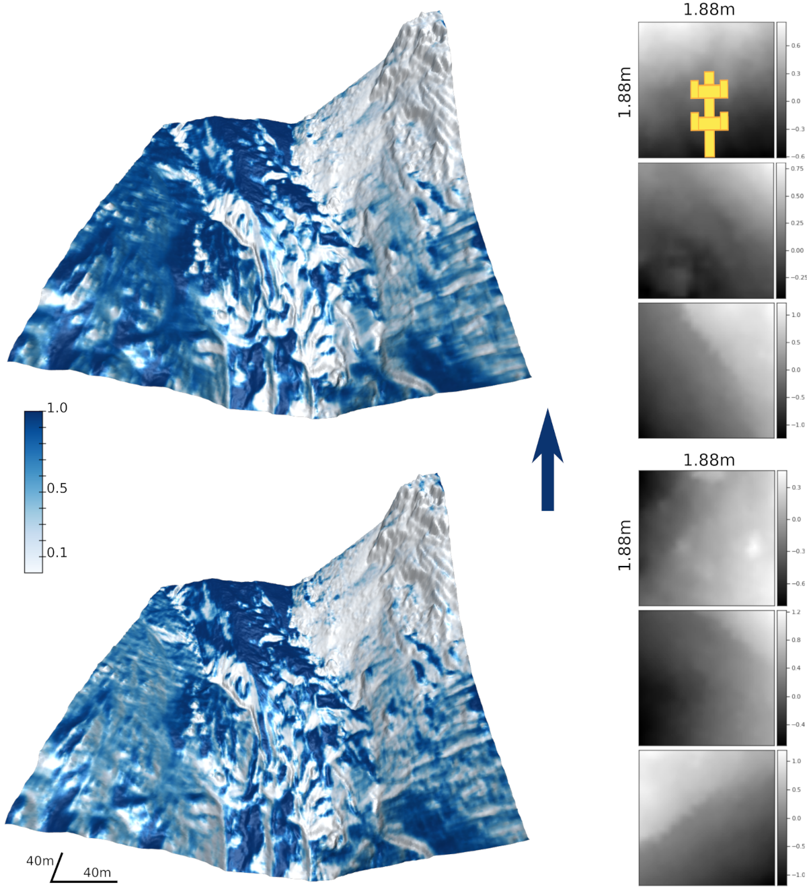

## Supplementary media for Gait-dependent Traversability Estimation on the k-rock Robot paper

The k-rock2\krock platform is an amphibious sprawling posture robot with multimodal locomotion capabilities, able to traverse land and water. The platform and its predecessor have been operated in limited field scenarios to test the robot's capabilities. The robot has several distinct locomotion modes; sprawling, legged locomotion is used for traversing overland with several parameterized gaits at its disposal. Additionally, an undulating swimming mode uses the robot's articulated tail and spine to propel itself along the water body's surface when equipped with a dry suit. The robot hosts several sensors onboard and allows online modifications of its locomotion behavior at the operator's demand.

Aletsch glacier elevation map.

Traversability maps on the Aletsch glacier map for the low and high gaits. 

Results on the gait selection approach.

